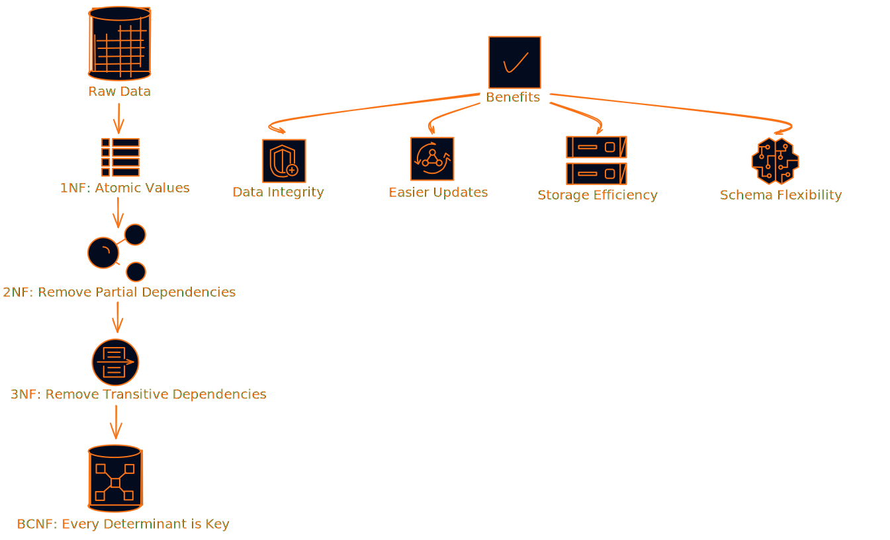
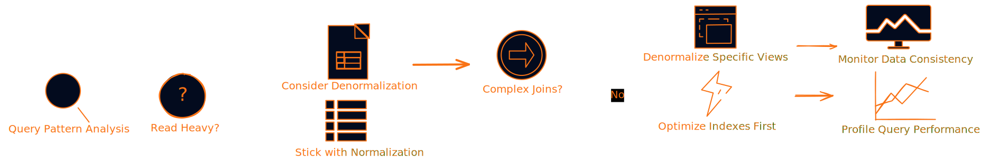
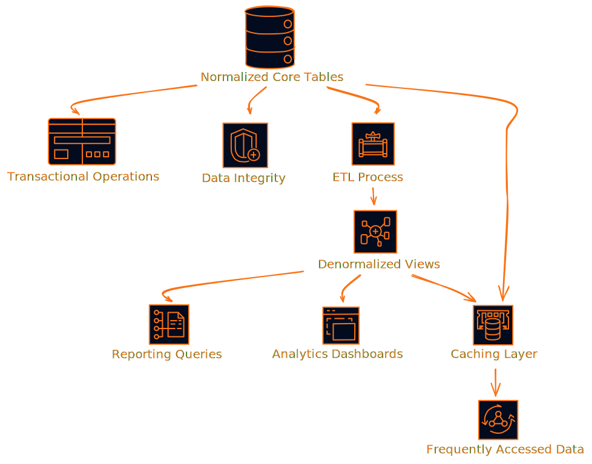
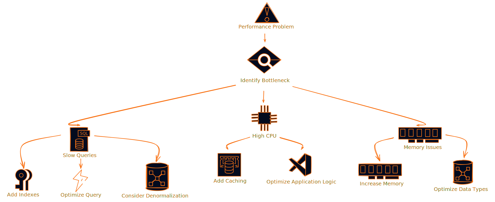
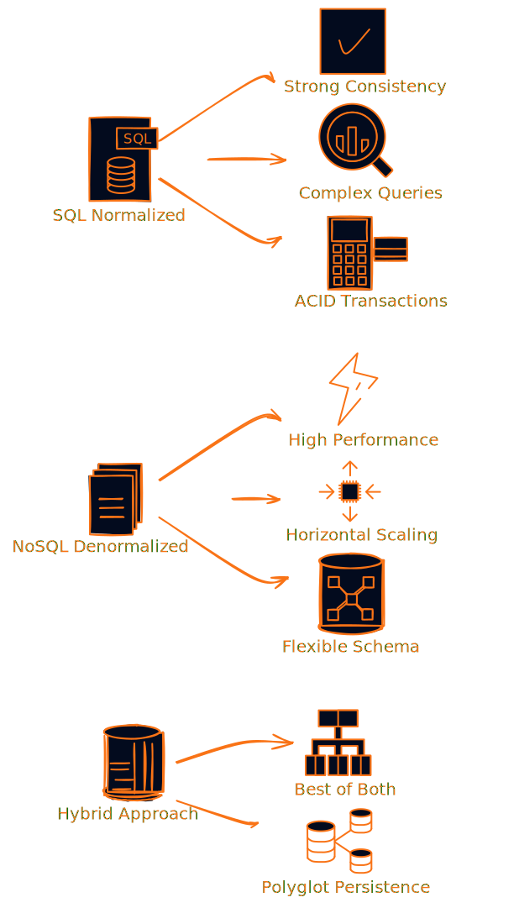

# Database Design Reality Check: When to Normalize vs When to Denormalize (And Why Most Teams Get It Wrong)

Look, I've been building systems for years, and I can't tell you how many times I've walked into a project where someone decided to "optimize" their database by throwing normalization out the window. Or worse, they've normalized everything to death and wonder why their reports take forever to load.

The truth is, the normalization vs denormalization debate isn't really a debate at all. It's about understanding your data, your workload, and making smart trade-offs. Let me break down what I've learned the hard way.

## The Real Problem Most Teams Face

Here's what usually happens: You start with a normalized database because that's what you learned in school. Everything's clean, no redundancy, foreign keys everywhere. Then your app grows, users complain about slow queries, and suddenly someone suggests "let's denormalize for performance."

But here's the thing - most teams don't actually understand what they're optimizing for. They just know something's slow and denormalization sounds like a magic bullet.

**Spoiler alert: It's not.**

## What Normalization Actually Gives You (Beyond the Textbook)

Normalization isn't just about eliminating redundancy. It's about creating a system that can evolve without breaking everything.

### The Hidden Benefits Nobody Talks About

**1. Your Future Self Will Thank You**
When you need to add a new field or change business logic, normalized schemas adapt way easier. I've seen teams spend weeks updating denormalized tables because they stored customer names in 47 different places.

**2. Debugging Becomes Possible**
Ever tried to figure out why data is inconsistent when it's duplicated across multiple tables? It's like playing detective with half the clues missing.

**3. Storage Actually Matters**
Yeah, storage is cheap, but when you're dealing with millions of records, that "cheap" storage adds up. Plus, smaller tables mean better cache utilization.

## When Denormalization Makes Sense (And When It Doesn't)

Here's where most people mess up. They think denormalization is always about performance. But it's really about matching your data structure to your access patterns.

### The Real-World Scenarios

**Denormalization Works When:**
- You're building a reporting system that runs the same complex queries repeatedly
- You have read-heavy workloads (like product catalogs or content management)
- You're dealing with time-series data where historical accuracy matters more than real-time updates
- You're building analytics dashboards where query speed trumps storage efficiency

**Denormalization Backfires When:**
- Your data changes frequently (hello, e-commerce inventory)
- You have multiple applications accessing the same data
- Your team doesn't have solid processes for maintaining data consistency
- You're trying to fix performance problems that could be solved with better indexing

## The Hybrid Approach That Actually Works

Most successful systems I've worked on don't pick one approach. They use both strategically.

### The CQRS Pattern: Best of Both Worlds

Command Query Responsibility Segregation (CQRS) is basically the grown-up version of this hybrid approach:

- **Write side**: Fully normalized, ACID compliant, handles all your business logic
- **Read side**: Denormalized views optimized for specific query patterns
- **Event bus**: Keeps everything in sync asynchronously

This pattern works especially well in microservices architectures where different services have different data needs.

## The Performance Reality Check

Let's talk numbers. I've seen teams obsess over denormalization to save milliseconds on queries while ignoring the fact that their application makes 50 database calls per page load.

### What Actually Impacts Performance

**1. Indexes Matter More Than Schema Design**
A well-indexed normalized table often outperforms a poorly designed denormalized one. Start here before you start duplicating data.

**2. Query Patterns Beat Schema Patterns**
Understanding how your application actually accesses data is way more important than following textbook rules.

**3. Caching Solves Most Problems**
Redis or Memcached can often give you the performance benefits of denormalization without the maintenance headaches.

## Common Mistakes I See Teams Make

### Mistake #1: Premature Denormalization
"We might need to run reports, so let's denormalize everything now." This is like buying a truck because you might need to move furniture someday. Start normalized, denormalize when you have actual performance problems.

### Mistake #2: All-or-Nothing Thinking
You don't have to choose one approach for your entire system. Different parts of your application can use different strategies.

### Mistake #3: Ignoring Maintenance Costs
Denormalized data doesn't maintain itself. You need triggers, stored procedures, or application logic to keep everything in sync. Factor this into your decision.

### Mistake #4: Not Measuring Impact
If you can't measure the performance improvement from denormalization, how do you know it was worth the complexity?

## Practical Decision Framework

Here's the framework I use when making these decisions:

### Step 1: Understand Your Workload
- What's your read-to-write ratio?
- Which queries are actually slow?
- How often does your data change?
- What are your consistency requirements?

### Step 2: Try the Simple Solutions First
- Add appropriate indexes
- Optimize your queries
- Implement caching
- Consider materialized views

### Step 3: Measure Everything
- Baseline your current performance
- Identify your actual bottlenecks
- Set clear performance targets

### Step 4: Implement Incrementally
- Start with the highest-impact changes
- Denormalize specific views, not entire schemas
- Keep your core transactional data normalized

## The NoSQL Angle

NoSQL databases have changed this conversation quite a bit. Document databases like MongoDB naturally encourage denormalization because they're optimized for document retrieval rather than relational queries.

But here's the thing - the same principles apply. You still need to understand your access patterns and make conscious trade-offs between consistency and performance.

## Real-World Examples That Actually Matter

### E-commerce Product Catalog
- **Normalized**: Product details, categories, pricing in separate tables
- **Denormalized**: Product listing pages with embedded category names and current prices
- **Why**: Product browsing is read-heavy, but inventory and pricing change frequently

### Social Media Feed
- **Normalized**: Users, posts, relationships in separate tables
- **Denormalized**: Timeline feeds with embedded user info and post content
- **Why**: Feeds need to load fast, but user profiles don't change often

### Financial Reporting
- **Normalized**: Transaction data with proper audit trails
- **Denormalized**: Monthly/quarterly summary tables for dashboard queries
- **Why**: Regulatory compliance requires normalized source data, but reports need speed

## The Monitoring and Maintenance Reality

If you decide to denormalize, you're signing up for ongoing maintenance. Here's what that actually looks like:

### Data Consistency Checks
You need automated processes to verify that your denormalized data matches your source of truth. This isn't optional.

### Update Procedures
Every time you update normalized data, you need to update the denormalized copies. This can be done with:
- Database triggers (immediate but can impact write performance)
- Application logic (flexible but easy to forget)
- ETL processes (scalable but introduces latency)

### Schema Evolution
When your business requirements change, you'll need to update both your normalized and denormalized structures. Plan for this complexity.

## What I'd Do If I Were Starting Today

If I were building a new system from scratch, here's my approach:

1. **Start with a properly normalized schema** - Get your data model right first
2. **Build comprehensive monitoring** - You can't optimize what you can't measure
3. **Implement caching early** - Redis is easier than denormalization
4. **Use materialized views** - Let the database handle the complexity when possible
5. **Denormalize selectively** - Only when you have clear performance requirements and measurement

The key is being intentional about your choices rather than following dogma.

## The Bottom Line

Normalization vs denormalization isn't really about picking sides. It's about understanding your system's needs and making informed trade-offs.

Most successful systems use both approaches strategically - normalized data for consistency and integrity, denormalized views for performance where it matters.

The real skill isn't knowing the rules of normalization or the techniques of denormalization. It's knowing when to apply each approach and how to manage the complexity that comes with your choices.

Start simple, measure everything, and optimize based on real problems rather than theoretical ones. Your future self (and your team) will thank you.

---

**What's your experience with normalization vs denormalization?** Have you run into situations where the "right" choice wasn't obvious? I'd love to hear about the trade-offs you've had to make in the comments.

*P.S. - If you're dealing with performance issues in your database, don't assume denormalization is the answer. Profile your queries, check your indexes, and measure the actual impact of any changes you make. Most performance problems have simpler solutions than you think.*
