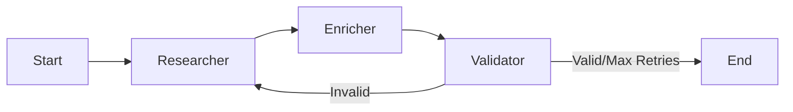

# Company Research & Enrichment Agent

This agent utilizes **LangGraph**, **Tavily API**, and **AWS Bedrock (Claude 3.5 Sonnet)** to automate the research of companies and their founders. It takes a list of companies and enriches them with detailed metadata, contact information, and social profiles.

## Capabilities

The agent performs a multi-step research workflow:
1.  **Company Research**:
    *   Staff Strength, Description, Domain, and LinkedIn URL.
    *   **Twitter/X Profile**: Dedicated search for official company handles.
    *   **Phone Number**: Dedicated search for generic corporate/support lines.
2.  **Founder Identification**:
    *   Identifies key founders via LinkedIn and web search.
3.  **Founder Enrichment**:
    *   **Contact Info**: Email addresses (best-effort search).
    *   **Socials**: Dedicated search for Founder's Twitter/X profile.
4.  **Validation Loop**:
    *   Strict Regex validation for Twitter/X URLs.
    *   Checks for data completeness and re-runs research if critical info is missing.

## Prerequisites

### API Keys
1.  **AWS Bedrock**: Access to `anthropic.claude-3-sonnet-20240229-v1:0` in `us-east-1` (or your configured region).
2.  **Tavily API**: A valid API key for web search.

### Configuration
Update `supporting-python-scripts/config.json`:

```json
{
    "aws": { ... },
    "tavily": {
        "api_key": "tvly-..."
    }
}
```

### Dependencies
Install the required packages:

```bash
pip install langgraph langchain langchain-aws tavily-python pandas
```

## Usage

### Prepare Input
Create a CSV file (e.g., `companies.csv`) with the following headers:
*   `Company Name`
*   `LinkedIn URL`

Example:
```csv
Company Name,LinkedIn URL
Checkr,https://www.linkedin.com/company/checkr-com/
Clipboard,https://www.linkedin.com/company/clipboard/
```

### Run the Agent
Run the main script from the `supporting-python-scripts` directory:

```bash
python3 research_agent/main.py --input research_agent/test_companies.csv --output enriched_companies.csv
```

### Arguments
*   `--input`: Path to the input CSV file (Required).
*   `--output`: Path to the output CSV file (Default: `enriched_companies.csv`).

## Output Format

The output CSV will contain:
*   **Company Metadata**: Domain, Description, Staff Strength.
*   **Socials**: `Company Twitter`, `Company LinkedIn`.
*   **Contacts**: `Company Phone` (Generic Corporate/Support).
*   **Founder Details**: Names, Emails, Phones, LinkedIns, Twitters.
    *   *Note*: Multiple founders are semicolon-separated (e.g., `Founder1; Founder2`).

## Architecture

The agent is built on **LangGraph** with a stateful workflow:



*   **Researcher Node**: Gathers initial consolidated data using multiple specific search tools.
*   **Enricher Node**: Drills down into specific founder details.
*   **Validator Node**: Ensures data quality (e.g. `x.com` regex) and requests retries if needed.
